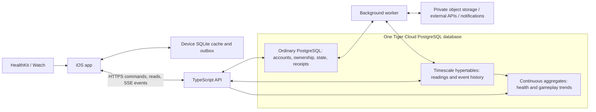

# 01 — Architecture and rationale

## One cloud database, three kinds of responsibility

The API and worker are separate process roles from the same backend codebase. They may initially share a host. Both connect to the same primary database. No Redis, message broker, read replica, or second PostgreSQL server is required initially.

| Component | Owns | Does not own |
|---|---|---|
| Ordinary PostgreSQL, `app` schema | Users, profiles, permanent collections, balances, claims, battle state/results, durable nutrition/workout records | Animation frames or high-frequency sample scans for every screen |
| TimescaleDB, `telemetry` schema | Time-organized readings, changes, battle events, and analytic facts | Sole copy of ownership, wallet balance, reward entitlement, or authentication |
| Continuous aggregates, `analytics` schema | Reusable time-bucketed trends | Immediate combat eligibility or settlement decisions |
| PostgreSQL, `ops` schema | Transactional outbox, jobs, retry receipts, synchronization cursors, lifecycle checkpoints | A public mobile SQL endpoint |
| Backend | Authentication, validation, game rules, transactions, streams, provider calls | Durable state held only in process memory |
| Device SQLite | Bounded snapshots, recent detail, offline drafts, upload queue | Final ranked outcomes, spendable balances, or an independent cloud replica |
| Bundled app resources | Starter/reference assets and offline practice behavior | Personalized authoritative account state |
| Object storage / external services | Photos, generated art files, food lookup, image analysis, push delivery | Replacement ownership/progression database |

Object storage is not a second application database. PostgreSQL stores object references, ownership, verification status, expiry, and hashes. Do not put full-resolution images, base64 uploads, or generated media into hypertables.

## Why Tiger Data fits this app

NutriQuest connects real-world observations with a time-sensitive game. It needs recent readings, daily nutrition, time-limited buffs, ordered battle events, season history, and longer-term progress. These are natural time-series workloads even when events arrive every few minutes or hours, not milliseconds.

Hypertables organize time ranges automatically; continuous aggregates avoid recalculating the same history repeatedly; columnstore can reduce the footprint of older retained facts; retention removes obsolete time ranges efficiently. Normal PostgreSQL remains available for transactions and relationships in the same system. These are documented extension capabilities, not a promised performance multiplier for our workload. [Tiger Data documentation](https://www.tigerdata.com/docs)

The strongest track demonstration is a working product sequence: ingest timestamped observations, update battle readiness, run a durable replayable battle, join battle history with nutrition/activity context, and show historical summaries surviving raw-event expiry. Each demonstrated capability needs tests and measured query plans, not just a dependency in the manifest.

## Direct answers to the requested tradeoffs

1. **Network dependence is an accepted boundary.** Cached screens, bundled content, drafts, and practice/LAN play remain available offline. New ranked matches, spending, contested ownership changes, and final rewards require the backend. The design concern is clear pending/stale UI, not avoiding the cloud.
2. **Trial credits support development.** Do not optimize prematurely around an unverified bill. Still bound queries, retries, connections, jobs, and caches. Record actual service/credit limits during authorized setup; no credential inspection is needed to approve this design.
3. **Choose partition defaults now; tune with evidence.** Use a handful of time-partitioned tables, no player-per-table design and no hash partitions initially. Chunk intervals in [04](04-timescale-design.md) are starting settings, not irreversible game rules.
4. **Hypertables already are PostgreSQL tables extended by TimescaleDB.** The backend uses one PostgreSQL driver and SQL can join a battle record to its event hypertable. Queries against Tiger Cloud-hosted data execute on that service. Connecting through a different SQL client or local PostgreSQL does not move that work off the hosted database. Self-hosted PostgreSQL with TimescaleDB is possible but would be a different deployment choice, with operations and data movement to manage.
5. **There is no separate hypertable SQL query toll in the published pricing model.** Published charges are based on service compute/storage and applicable features. More queries consume provisioned resources and can eventually require more capacity; normal tables on that same service use those resources too. Pooling, bounded indexes, batched ingestion, and reusable summaries are the main initial optimizations. [Tiger Cloud pricing](https://www.tigerdata.com/pricing)
6. **TimescaleDB should be central where it helps.** Battle events are durable product data in a hypertable; health and nutrition history drive real features. Wallets and ownership remain regular tables because their identity and transactional constraints matter more than their timestamps.
7. **Three-day deletion is a lifecycle policy, not blanket data loss.** Replay detail expires after 72 hours from completion; final results and reward evidence remain. Device caches have age and size limits. Unsynced user work is protected. See [06](06-retention-and-offline.md).
8. **Use ordinary PostgreSQL when hypertables do not fit.** Both are part of Tiger Cloud. Neither replaces image recognition, APNs, a socket transport, or HealthKit itself; the database stores their inputs/results and the backend coordinates them.

## Live vs historical work

- **Immediate:** current daily state, ownership, wallet, a accepted battle action, and rewards. Read/write transactional rows and append necessary events in the same transaction.
- **Live delivery:** stream committed battle events through SSE. Client animation is local. For future player-input turns, accept commands over HTTPS; add WebSockets only if bidirectional interaction actually needs them.
- **Near-real-time trends:** refresh relevant aggregates every 5–15 minutes; optionally include the newest raw tail with explicit real-time aggregate configuration.
- **Historical reports:** read retained summaries on screen open, at battle end, and hourly/daily as appropriate. Do not poll every inactive device every few minutes.

No aggregate refresh is required to decide who won. No live health change modifies a battle already started: its input snapshot is frozen.

## Intentional costs and limits

This design accepts operating a small worker, implementing offline conflict handling, versioning game rules, and learning Timescale lifecycle rules. SQLite and PostgreSQL have different schemas because they have different jobs. They are not maintained by bidirectional table replication.

There is some Timescale-specific SQL and operational dependence. Ordinary tables and pure game logic stay portable, but continuous aggregates and lifecycle policies would need replacement on a different database. That is an intentional tradeoff in favor of the product and Tiger Data track.
