# NutriQuest — Entity Relationship Diagram

Domain-level entity model, generated to match [`DATA-MODELS.md`](DATA-MODELS.md).
`snake_case` in DB.

> **Status.** This is the design model, not a dump of the deployed schema. The
> implemented Postgres schema is `backend/migrations/` (schemas `app`, `telemetry`,
> `analytics`, `ops`), described table by table in
> [`db-documentation/03-relational-model.md`](../db-documentation/03-relational-model.md).
> Entity names here map onto it rather than matching it one-for-one — for example
> this diagram's `characters` is `app.owned_characters`, and `capsule_ledger` is
> `app.currency_entries`. Read this for the shape of the domain; read the
> migrations for what exists.

> NEW entities (issues #67–#81) marked with ★.

```mermaid
erDiagram
  auth_users ||--|| players : "id"
  players ||--|| profiles : "player_id"
  players ||--o{ body_metric_log : "★ weight history"
  players ||--o{ characters : "owns"
  players ||--o{ day_logs : "logs"
  players ||--o{ daily_state : "per day"
  players ||--o{ training_buffs : "earns"
  players ||--o{ gym_checks : "submits"
  players ||--o| fatigue : "state"
  players ||--o{ rankings : "per season"
  players ||--o{ capsule_ledger : "earns/spends"
  players ||--o{ coin_ledger : "★ earns/spends"
  players ||--o{ capsule_opens : "opens"
  players ||--o| capsule_pity : "pity state"
  players ||--o{ merge_events : "★ merges"
  players ||--o{ gamble_sessions : "★ gambles"
  players ||--o{ battles : "player_a/player_b"
  players ||--o{ audit_log : "subject"

  products ||--o{ characters : "barcode"
  products ||--o{ day_logs : "barcode (logical)"

  character_catalog ||--o{ characters : "★ catalog_id"
  character_catalog ||--o{ character_images : "★ per-rarity art"
  character_catalog ||--o{ character_attacks : "★ moveset"
  attacks ||--o{ character_attacks : "★"

  characters ||--o| character_lore : "lore"
  characters ||--o{ capsule_opens : "granted"
  characters ||--o{ gamble_pot_entries : "★ in pot"
  characters ||--o{ merge_events : "★ consumed/result"

  gamble_sessions ||--o{ gamble_pot_entries : "★ 1..3 entries"
  gamble_sessions ||--o| crash_sessions : "★ crash state"

  rarity_bands ||--o{ characters : "★ net_worth -> rarity"

  seasons ||--o{ rankings : "season_id"

  battles ||--o{ characters_battle_snapshot : "squad snapshot"
  battles ||--o| arena_matches : "escrow"

  players {
    uuid id PK "= auth.users.id"
    text display_name
    timestamptz last_seen_at
    text device_hash "anti-multiaccount"
  }
  profiles {
    uuid player_id PK,FK
    int age "CHECK 10..100"
    text sex "male|female"
    numeric height_cm
    numeric weight_kg
    text body_type "★ ecto|meso|endo"
    text activity "sedentary|light|moderate|active"
    text goal "cut|maintain|bulk"
    int calorie_target "derived (Mifflin-St Jeor)"
    int protein_target "derived (g/kg)"
    int fiber_target "derived (25g/2000kcal)"
  }
  body_metric_log {
    uuid id PK "★"
    uuid player_id FK
    numeric weight_kg
    timestamptz logged_at "append-only; triggers goal recompute"
  }
  products {
    text barcode PK
    jsonb nutriments
    int nova_group
    int unique_scans "scarcity"
    numeric price_tier
    numeric micro_score "0..1 computed"
    text food_group
  }
  character_catalog {
    int id PK "★"
    text slug UK
    text name
    text bio
    jsonb base_stats
    text base_rarity
    text element
  }
  characters {
    uuid id PK
    uuid player_id FK
    text barcode FK
    int catalog_id FK "★ null for generated"
    text element "protein|fiber|vitamin|hydration"
    text rarity "common|uncommon|rare|epic|legendary"
    int star_level "★ 0..5 (was fusion_tier)"
    int net_worth "★ coins; drives rarity"
    boolean locked "★ staked/in-pot"
    jsonb base_stats "nutrition-derived"
    text art_url
  }
  character_images {
    text character_key PK "★"
    text rarity PK
    text image_key
  }
  merge_events {
    uuid id PK "★ (supersedes fusion_events)"
    uuid player_id FK
    uuid result_id FK
    uuid_array consumed_ids "length = 3"
  }
  attacks {
    int id PK "★"
    text name
    text kind "basic|signature|special"
    numeric power
    jsonb effect
    text min_rarity "rarity gate"
  }
  character_attacks {
    text character_key PK "★"
    int attack_id PK,FK
  }
  day_logs {
    uuid id PK
    uuid player_id FK
    text barcode
    date log_date "UNIQUE(player,barcode,date)"
    numeric calories
    numeric protein_g
    numeric fiber_g
    numeric sugar_g
    numeric micro_score
    text food_group
    boolean counts_toward_multiplier "anti-gaming caps"
  }
  daily_state {
    uuid player_id PK,FK
    date log_date PK
    numeric multiplier "CHECK 0.8..1.5"
    jsonb breakdown
    jsonb objectives "★ dynamic: BMI/BMR band"
    int rank_points "★ daily consistency"
  }
  training_buffs {
    uuid player_id PK,FK
    timestamptz granted_at PK
    timestamptz expires_at "+24h"
    text photo_path "private storage"
  }
  gym_checks {
    uuid id PK
    uuid player_id FK
    text photo_path "private, signed URL 15m"
    jsonb vision_result
    boolean passed
    timestamptz checked_at "UNIQUE 1/day"
  }
  battles {
    uuid id PK
    text mode "expedition|ranked|arena"
    bigint seed "HMAC(matchId, SERVER_SECRET)"
    uuid player_a FK
    uuid player_b FK
    boolean is_bot_b "★ same-rank bot fallback"
    jsonb squad_a "3 character ids"
    jsonb squad_b
    jsonb replay "authoritative"
    uuid winner "null = draw"
  }
  characters_battle_snapshot {
    uuid id PK
    uuid battle_id FK
    uuid player_id FK
    jsonb units "immutable, full stats + attacks"
  }
  rankings {
    uuid player_id PK,FK
    int season_id PK,FK
    int rating "Elo, start 1000"
    int rank_points "★ consistency progression"
    text tier "bronze|silver|gold|plat -> badge"
    int wins
    int losses
  }
  seasons {
    int id PK
    date starts_at
    date ends_at
    text status "active|ended"
  }
  fatigue {
    uuid player_id PK,FK
    timestamptz fatigued_until
    text recovery_quest
  }
  arena_matches {
    uuid battle_id PK,FK
    int stake "capsules"
    uuid char_stake_a FK "★ character stake"
    uuid char_stake_b FK "★"
    int escrow_a
    int escrow_b
    boolean settled
  }
  capsule_ledger {
    uuid id PK
    uuid player_id FK
    int amount "CHECK != 0; append-only"
    text reason
    uuid ref_id
  }
  coin_ledger {
    uuid id PK "★"
    uuid player_id FK
    int amount "CHECK != 0; append-only"
    text reason "sell|gamble_*|battle_*|crash_cashout"
    uuid ref_id
  }
  capsule_opens {
    uuid id PK
    uuid player_id FK
    text rarity
    uuid character_id FK
    int pity_counter
  }
  capsule_pity {
    uuid player_id PK,FK
    int since_epic
    int since_legendary
    int total_opens
  }
  gamble_sessions {
    uuid id PK "★"
    uuid player_id FK
    text mode "pot|crash"
    text status "active|won|lost|cashed_out"
    int pot_value "summed net worth"
    text seed_commit "HMAC hash, provably fair"
    jsonb result
  }
  gamble_pot_entries {
    uuid session_id PK,FK "★"
    uuid character_id PK,FK
  }
  crash_sessions {
    uuid session_id PK,FK "★"
    numeric crash_point "server-chosen"
    numeric cashout_mult "null = crashed"
    uuid payout_character_id FK
  }
  rarity_bands {
    text rarity PK "★"
    int min_net_worth "exponential edges"
  }
  character_lore {
    uuid character_id PK,FK
    text lore
    text catchphrase
  }
  audit_log {
    uuid id PK
    uuid player_id
    text action
    text entity
    uuid entity_id
    jsonb before
    jsonb after
  }
```

## Server-side functions (source of truth, not client-trusted)

| Function | Purpose | Issue |
|---|---|---|
| `derive_targets()` | BMI/BMR calorie/protein/fiber targets — recompute on every `body_metric_log` insert | #89 |
| `recalc_objectives()` | Dynamic daily food priorities from current BMI/BMR band | #90 |
| `award_rank_points()` | Daily rank points from eating consistency, idempotent per (player, day) | #83 |
| `tier_for_points()` / `apply_rank_change()` | Bronze→Plat thresholds, promotion/demotion, badge | #84 |
| `matchmake_ranked()` | Exact-tier pairing, same-tier bot fallback | #85 |
| `rank_scaled_odds()` | Pull odds modifier by rank tier (with pity intact) | #86 |
| `compute_base_stats()` / `element_from_stats()` / `compute_micro_score()` | Character stats from nutrition | #104 |
| `compute_net_worth()` | f(stats, rarity, ★) → coin value | #118 |
| `rarity_for_worth()` | `rarity_bands` lookup — single rarity source | #119 |
| `revalue_character()` | Recompute net worth → rarity after every mutation | #120 |
| `do_merge()` / `merge_events_validate()` | Consume exactly 3 same-char same-★ copies | #111 |
| `sell_character()` | Character → coins, locked check, ledger write | #115 |
| `open_capsule()` / `roll_rarity()` | Seeded roll (HMAC) + pity | #11 |
| `create_arena_match()` / `settle_arena()` | Escrow + character stakes + 5% burn, single transaction | #116 |
| `pot_resolve()` | Gamble 1–3 characters on summed value | #124 |
| `crash_start()` / `crash_cashout()` | HMAC crash point, race-safe cash-out, payout monster | #127/#128 |
| `character_mutate()` | Single atomic path for merge/sell/stake/pot ops + lock | #133 |
| `coin_ledger_guard()` / `block_mutation()` | Balance never negative + append-only | #114 |
| `apply_daily_caps()` | 1 barcode/day + 3/hour (trigger on `day_logs`) | #9 |
| `recalc_multiplier()` | Daily Party Multiplier + breakdown + objectives | #9 |
| `close_day()` | Midnight cron: expire buffs, award rank points, close day rows | #9/#83 |
| `battles_ranked_eligibility()` | Squad size 3 + scanned today + no fatigue + not locked | #10 |
| `start_season()` / `close_season()` | Weekly season lifecycle + soft reset | #10 |
| `write_audit()` | Audit trail on economy/battle/collection | #12 |
